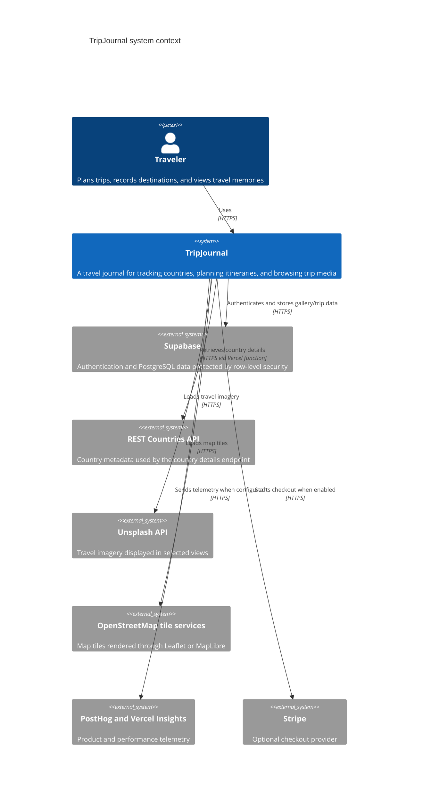
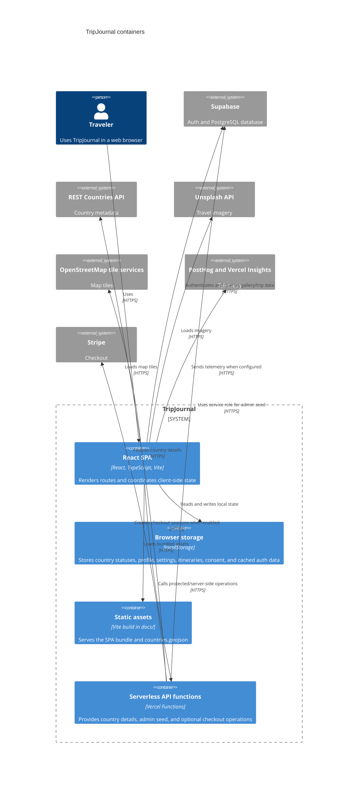
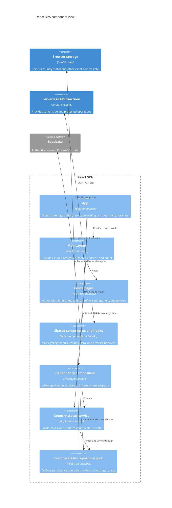
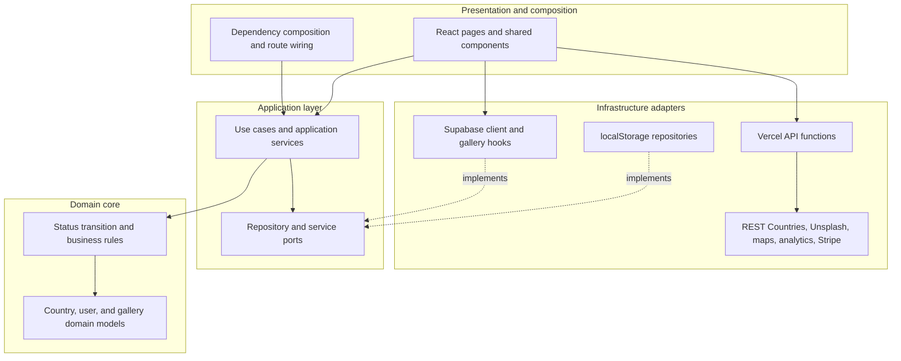
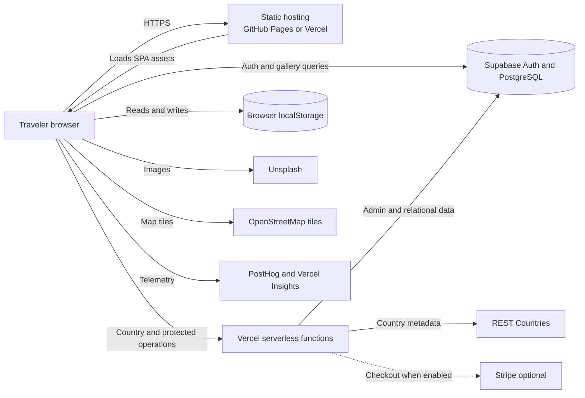
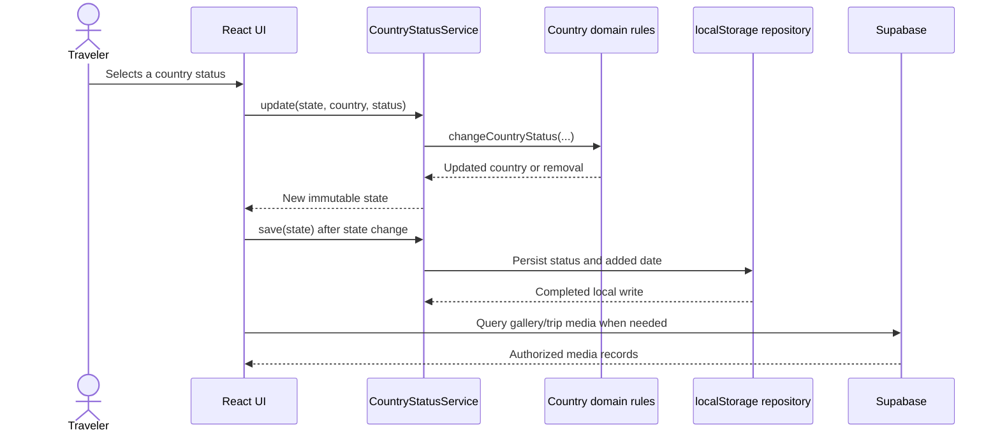

# TripJournal Architecture

This document describes the current runtime architecture of TripJournal. It focuses on the boundaries between the browser application, browser persistence, Vercel functions, Supabase, and third-party services.

## C4 Model

### System Context



### Container View



The React SPA contains the route pages, shared components, hooks, application services, and infrastructure adapters described below. The browser storage and API boundaries are shown as separate containers because they own persistence and server-side behavior outside the React component tree.

### Component View: React SPA

This view zooms into the React SPA container. The application currently uses a small dependency-composition root and a country-status vertical slice as its clearest example of the application, domain, and infrastructure boundaries.



### Code View: Country Status Slice

The code-level view follows the country-status update path, which is the most explicit layered slice in the current codebase. The domain decides what a valid status transition is; the application service coordinates it; the infrastructure adapter persists it; and `App` supplies the UI state boundary.

```mermaid
    C4Code
    title Country status code view

    Container_Boundary(countrySlice, "Country status slice") {
        Component(appComponent, "App", "src/App.tsx", "Owns React state and passes status actions to pages")
        Component(compositionRoot, "appDependencies", "src/app/composition.ts", "Composes the service with its repository")
        Component(service, "CountryStatusService", "src/application/country/CountryStatusService.ts", "Coordinates load, save, and update operations")
        Component(repositoryPort, "CountryStatusRepository", "src/application/country/CountryStatusRepository.ts", "Application-owned persistence contract")
        Component(countryEntity, "Country and changeCountryStatus", "src/domain/country/Country.ts", "Encapsulates country status rules")
        Component(localRepository, "LocalCountryStatusRepository", "src/infrastructure/country/LocalCountryStatusRepository.ts", "Serializes validated state to localStorage")
    }

    Container(browserStorage, "Browser storage", "localStorage", "Client-side persistence")

    Rel(appComponent, compositionRoot, "Uses appDependencies")
    Rel(appComponent, service, "Loads, saves, and updates state")
    Rel(compositionRoot, service, "Creates")
    Rel(compositionRoot, localRepository, "Provides implementation")
    Rel(service, repositoryPort, "Depends on")
    Rel(service, countryEntity, "Applies status transition")
    Rel(localRepository, repositoryPort, "Implements")
    Rel(localRepository, browserStorage, "Reads and writes JSON")
```

## Onion Architecture

TripJournal follows an onion-style dependency direction for business behavior. The domain is independent of React, browser APIs, Supabase, Vercel, and third-party services. Application services depend on domain rules and ports; infrastructure implements those ports; the UI and composition root sit at the outside and assemble the system.



The arrows from adapters toward ports are intentionally dashed: infrastructure conforms to application-owned contracts rather than becoming a dependency of the domain. Some current UI integrations, such as Supabase gallery queries, are still called directly from hooks and are shown as an area for continued boundary hardening.

## Deployment View



## Primary Data Flow



## Main Containers

| Container | Responsibility | Main implementation |
| --- | --- | --- |
| React SPA | Renders the user interface and coordinates client-side state | `src/main.tsx`, `src/App.tsx` |
| Route pages | Home, countries, trips, itineraries, gallery, profile, settings, help, and policies | `src/pages/` |
| Shared UI and hooks | Layout, map, gallery, country data, Supabase gallery queries, and browser behavior | `src/components/`, `src/hooks/` |
| Browser storage | Persists country statuses, profile, settings, itineraries, auth cache, cookie consent, and cached GeoJSON | `localStorage` calls in `src/` |
| Static deployment | Serves the Vite build and bundled assets | `vite.config.ts`, output directory `docs/` |
| Vercel functions | Server-side proxy and protected operations | `api/` |
| Supabase Auth | Email and provider authentication, session persistence, and auth callbacks | `src/lib/supabase/client.ts` |
| Supabase database | Users, trips, destinations, entries, photos, activities, likes, comments, and API keys | `supabase/migrations/` |

## Data Ownership

### Browser-owned state

- Country statuses and added dates are managed by the country status service and saved to local storage.
- Profile and settings are cached in local storage.
- Itineraries are stored using the itinerary storage utilities.
- Cookie consent and the local auth cache are stored in local storage.
- `countries.geojson` is fetched from the deployed static assets and cached locally.

### Supabase-owned state

- Authentication sessions are managed by Supabase Auth.
- Gallery data is queried from `photos`, with related `trips` and `trip_entries` data.
- The database schema also supports trips, destinations, entries, activities, likes, comments, subscriptions, and API keys.
- Row-level security controls which authenticated users can access database records.

### External-service state

- Unsplash hosts the photos displayed by travel and gallery views.
- OpenStreetMap provides map tile data.
- PostHog and Vercel services receive telemetry when configured.
- Stripe is available through a checkout API function, but should be shown as optional unless a page actively calls that endpoint.

## Important Runtime Flows

### Application startup

1. `src/main.tsx` initializes PostHog and renders the React root.
2. `HashRouter` handles client-side navigation.
3. `src/App.tsx` registers routes and lazy-loads page bundles.
4. The application loads country status from the local repository.
5. `MainLayout` supplies shared navigation, footer, cookie consent, and the page outlet.

### Authentication

1. The Welcome page calls Supabase Auth for session lookup and sign-in.
2. Supabase persists and refreshes the session through the configured client.
3. A successful session is copied into the local auth/profile cache.
4. The user is redirected to `/home`.
5. Profile logout calls Supabase sign-out and clears local profile/auth cache entries.

### Country status tracking

1. Home receives country state from `App`.
2. The country status service updates the in-memory state.
3. A React effect saves the state through `LocalCountryStatusRepository`.
4. The browser restores the state on the next application load.

### Gallery and trip media

1. Gallery and trip pages call `useSupabaseGallery`.
2. The Supabase client queries `photos` and related trip records.
3. The hook maps database rows into UI gallery items.
4. The browser renders the returned media URLs and may request Unsplash photos separately for decorative or travel content.

### Country details

1. A country trip page calls `/api/country-details?name=...`.
2. The Vercel function requests matching data from REST Countries.
3. The function returns normalized JSON and applies a shared cache header.

### Admin sample-data seed

1. The admin page calls `/api/admin/seed-sample` in production.
2. The Vercel function validates the admin token and optional Basic Auth/IP restrictions.
3. The function uses the Supabase service role to create an auth user and sample relational data.
4. In development, the page writes a local seed result instead of calling the remote endpoint.

## Source References

- [Application bootstrap](../src/main.tsx)
- [Routes and country state](../src/App.tsx)
- [Dependency composition](../src/app/composition.ts)
- [Supabase client](../src/lib/supabase/client.ts)
- [Supabase gallery hook](../src/hooks/useSupabaseGallery.ts)
- [Country data hook](../src/hooks/useCountriesData.ts)
- [Vercel API functions](../api/)
- [Supabase schema](../supabase/migrations/20260603_0001_initial_schema.sql)
- [Vite deployment configuration](../vite.config.ts)

## Diagram Conventions

- Solid arrows represent active runtime flows.
- Dashed arrows represent optional or not-yet-connected integrations.
- Cylinders represent persistent data stores.
- The `docs/` directory is generated by Vite; keep source documentation in `documentation/`.